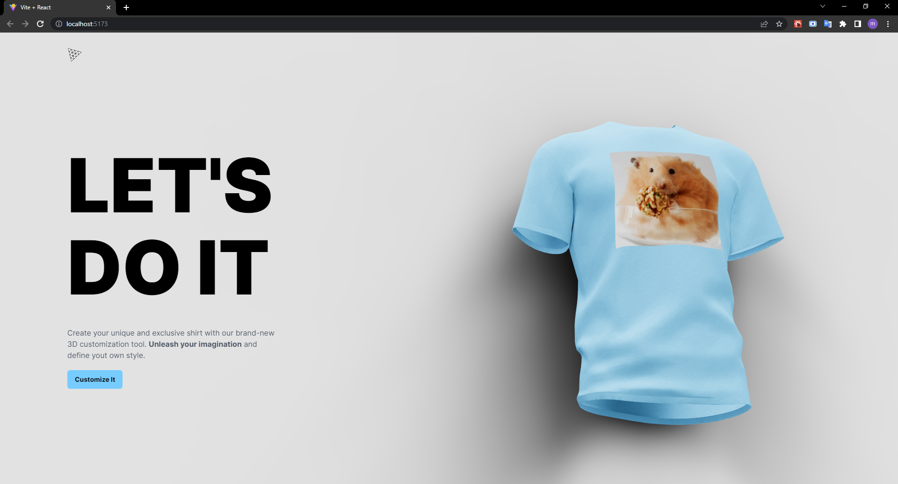
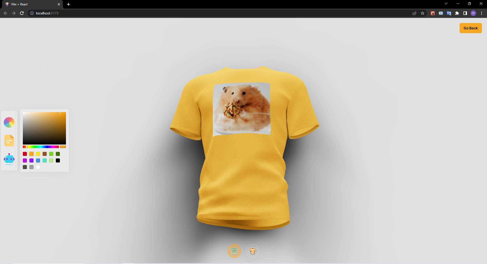
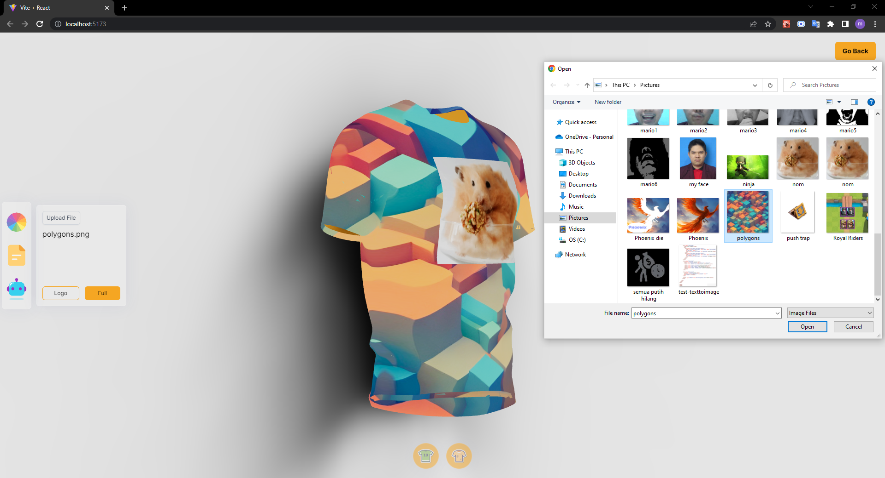
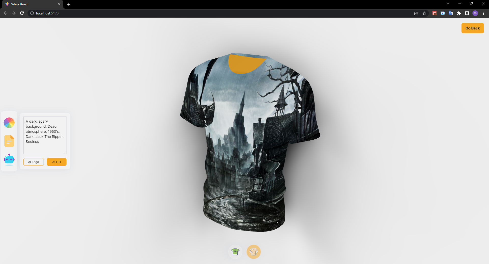
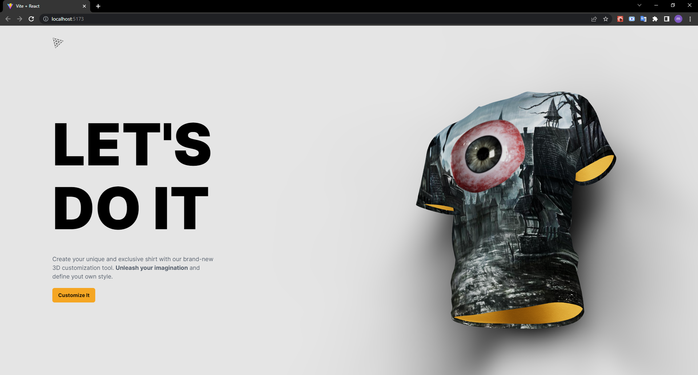

# 3D Shirt Customizer

A project where you can customize a 3-dimensional shirt with your own colors + images and preview its appearance live.

Project made by Mario (with some of my own code modifications).

---

Some screenshots:

---

The tutorial video can be found [here](https://www.youtube.com/watch?v=tllZWCQZ9_0).

